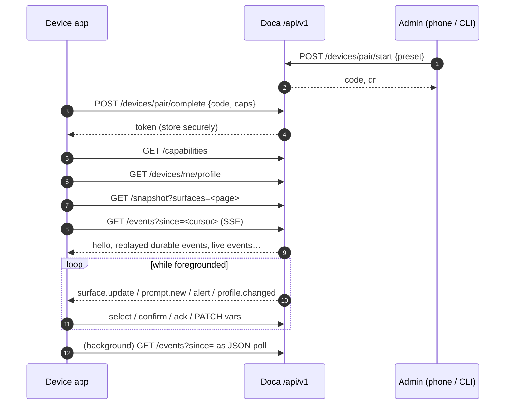

# Building a device app on the Doca client API

This guide is for the developer writing the software that runs **on the device**:
a Wear OS or watchOS app, a phone companion, a smart-glasses HUD, a car display, a
kiosk, a browser widget. It explains how to structure the app around the API so
that it works on small screens, over flaky links, on a battery, and keeps working
when the server adds things you have never heard of.

It complements [`PROTOCOL.md`](../../PROTOCOL.md) (exact wire formats) and the
[OpenAPI document](openapi.json) (request/response schemas). Sections reference
the protocol by number, e.g. *(§12)*. Code is pseudocode unless stated;
copy-paste versions live in the [cookbook](cookbook.md).

## 1. The mental model

- The server decides **what exists** (surfaces, commands, prompts), **what it means**
  (kinds, units, thresholds) and **what you are allowed to do** (scopes). Your app
  decides **how to draw it**. No layout, colour or typography crosses the wire.
- Your app describes its **abilities**, not its brand, once at pairing (`caps`).
  The server shapes everything after that: which prompt choices you get, which
  figure representation, which image size, which sensors can be asked of you.
- There is **one push channel** (`/events`). Everything unsolicited arrives there,
  with sequence numbers, so you can drop offline, come back with a cursor and miss
  nothing that mattered.
- **Ignore what you do not know.** New fields, event types, block types and choice
  types appear without a version bump. Skipping them is correct behaviour.

## 2. Lifecycle at a glance



Persist across restarts: the token, the last processed `seq`, the profile ETag,
and any `selectionId` still in flight.

## 3. Pairing and declaring capabilities *(§4.2, §7)*

### 3.1 The pairing screen

Your app has no token yet. Show one of:

- a **code entry** field (six digits, shown as `NNN-NNN` on the admin side), or
- a **QR scanner**: the admin app shows `qr` = `doca://pair?code=641598&host=doca.tailnet.ts.net:4242`.
  Parse `host` for the base URL and `code` for the pairing code.

Then call `POST /devices/pair/complete` with `{ code, name, caps }` and store the
returned `token` in the platform's secure store (Keychain, EncryptedSharedPreferences,
Keystore). Show the device `name` and `scopes` from the response so the user knows
what was granted. Codes expire after five minutes and are single-use; on
`400 invalid_pairing` send the user back to the admin device.

### 3.2 Writing honest `caps`

Everything is optional; the server fills defaults. Declare what the hardware and
your app can actually do **today** — the server will start sending you things
based on it. You can change it later with `PATCH /devices/me { caps }`.

```json
{
  "formFactor": "watch",
  "protocol":   { "max": "1.0" },
  "screen":     { "w": 450, "h": 450, "shape": "round", "dpr": 2, "color": true },
  "input":      { "touch": true, "voice": true, "text": false, "camera": false, "buttons": true, "crown": true },
  "audio":      { "mic": true, "speaker": false, "haptic": true },
  "render":     ["image", "sprite", "text"],
  "motion":     ["1"],
  "exec":       ["js"],
  "sensors":    ["heartRate", { "id": "accelerometer", "maxRateHz": 50 }, "battery", "heading"],
  "ext":        { "os": "wearos", "model": "Pixel Watch 3" }
}
```

What each section buys you:

| You declare | The server then |
|---|---|
| `screen` | sizes rendered images to fit (`render.defaults`, ≤ 480 px); omit it on a display-less device and figures come as `text` |
| `input.camera` | offers `image` choices in prompts (else they are filtered out) |
| `audio.mic` or `input.voice` | offers `voice` choices |
| `input.text`, `touch` or `voice` | offers `text` choices |
| `render: ["svg"]` | inlines SVG in figures and honours `format=svg` on render endpoints |
| `render: ["svg.smil"]` | also inlines *animated* SVG |
| `render: ["sprite"]` | sends animated figures as horizontal PNG sprite sheets you page through |
| `render: ["image"]` | sends figures as PNG URLs |
| `motion: ["1"]` | sends motion scenes (§10 below) instead of pixels when the author provided one |
| `exec: ["js", …]` | delivers artifacts for those runtimes (else they degrade to text) |
| `sensors` | lets agents *ask* for those sensors (only those; never anything else) |

Typical profiles:

- **Round watch**: as above. Prefer `image`/`sprite` over `svg` unless you ship an SVG renderer.
- **Phone**: `formFactor: "phone"`, `render: ["svg", "svg.smil", "image"]`, `input.text/camera: true`, `exec: ["js", "wasm"]`. Use the `phone` preset so it can also pair and manage other devices.
- **Glasses**: `formFactor: "glasses"`, small `screen` (or none), `input.camera: true`, `audio: { mic, speaker }`, sensors `heading`, `gaze`, `accelerometer`.
- **Voice-only speaker**: no `screen`, `audio: { mic: true, speaker: true }`. You still receive prompts; render them as speech and accept `voice` selections.
- **Browser kiosk**: `formFactor: "browser"`, `render: ["svg", "svg.smil", "image"]`, `motion: ["1"]`, `exec: ["js"]`.

### 3.3 Token hygiene

- Send `Authorization: Bearer <token>` on every request, plus `X-Doca-Client: <app>/<version>`.
- **Rotation**: `POST /devices/me/rotate` returns a new token; the old one works for 60 s more (`previousValidUntil`). Write the new one, then start using it.
- **Revoked**: you receive a durable `revoked` event, then an SSE `close` frame, then every call fails `401 invalid_token`. Wipe the token and return to the pairing screen. Do not retry.
- `401 invalid_token` at startup without a `revoked` event: the token expired or the server data was reset. Same handling.

## 4. Building screens from `capabilities` and the profile *(§6, §14)*

Call `GET /capabilities` right after pairing, on every app start, and after any
`profile.changed` or `resync` event. Then `GET /devices/me/profile`.

- `profile.pages[]` is the **navigation**: one entry per screen/card, in order.
  Each page lists surfaces and, optionally, which metrics of each to show, whether
  to include sparklines, how many list items, which item commands to expose.
- `capabilities.surfaces[]` is the **dictionary**: for every surface id you can read,
  the metric definitions (label, kind, unit, min/max, thresholds) and the commands
  that apply. Use it to build widgets without ever hard-coding `system.cpu.pct`.
- `capabilities.commands[]` is what this token may run. On a `watch` preset it is
  empty — do not render command buttons that will `403`.
- `profile.warnings[]` tells you (and the phone that edited the profile) which
  configured surfaces/commands this token cannot actually use; skip them.

Map metric fields to widgets:

| Field | Do this |
|---|---|
| `kind: gauge` + `min`/`max` | ring, bar or dial; `value/max` is your fill fraction |
| `kind: bytes`, `rate`, `duration`, `timestamp` | just show `display`; format yourself only if you must (`value` is bytes, per-second, seconds, ISO) |
| `kind: vector` | one value per element (per-core CPU); a tiny bar row works |
| `kind: enum`/`boolean`/`text` | a chip or label; `values[]` enumerates the possibilities |
| `thresholds[]` | ordered `{ level, gte }`; pick the highest `gte` ≤ `value`; map `level` to **your** palette (`warn`, `crit`); absence = no colouring |
| `value: null` | render `display` (`"—"`) in the muted style |
| `stale: true` or `now > observedAt + ttlSec` | grey the widget; the collector failed or the value is old |
| `spark[]` | ≤ 60 numbers, oldest first; draw a sparkline |

Lists (`kind: list`) give `items[]` each with `id`, `label`, `state` (map with
`capabilities.protocol.itemStates`), `detail`, optional per-item `metrics[]` and
ready-to-post `commands[]`. `truncated: N` means the list was cut at 40.

## 5. Reading data *(§9)*

Two ways, use both:

- **Snapshot** (`GET /snapshot?surfaces=a,b&spark=1`) when a screen appears or the
  app resumes. Ask only for the surfaces on that page; the budget is 16 KB per
  surface. Send `If-None-Match` with the last `ETag` and treat `304` as "unchanged".
- **Live** (`surface.update` events) while your stream is open. They follow the
  profile's `pages[].surfaces` and `refreshSec` — a device whose profile lists no
  surfaces gets none. They are *ephemeral*: never persist them, never rely on them
  to catch up; take a snapshot on connect instead.

All clients share one server-side sampler, so polling many surfaces is cheap for
the host, but every byte still costs you radio time: prefer the stream when
foregrounded and a snapshot on resume.

## 6. The push loop *(§11)*

Implement this state machine once and route everything through it.

```
connect(since=cursor)
  ├─ hello {cursor, replay, resync, heartbeatSec}
  │    resync=true → refetch capabilities, profile, prompts, snapshot; cursor = hello.cursor
  ├─ replayed durable events (ack:true) — process, cursor = seq
  ├─ live events — process, cursor = seq
  ├─ ": ping" every heartbeatSec — reset the watchdog
  ├─ no bytes for 2×heartbeatSec → close and reconnect
  ├─ event: close {reason} → if reason=revoked: wipe token; else reconnect
  └─ transport error → backoff (push.backoff: 1 s ×2 up to 60 s, ±20 % jitter), reconnect(since=cursor)
```

Rules that keep it correct:

- **Cursor** = highest `seq` you have fully processed. Persist it. Reconnecting with
  `since=<cursor>` acknowledges everything ≤ cursor implicitly.
- **Ack explicitly** (`POST /events/ack { seq }`) only when you stay connected for a
  long time and want the server to drop retained events sooner. Ephemeral events
  do not need acks; acking them is harmless.
- **Gaps are normal.** Ephemeral events consume sequence numbers but are not
  retained, so a replay after reconnect will skip numbers.
- **Dispatch by `type`**, ignore unknown types. Handle at least: `surface.update`,
  `prompt.new`, `prompt.outcome`, `prompt.closed`, `alert`, `profile.changed`,
  `revoked`, `resync`. Optional: `job.progress`/`job.done`, `agent.message`,
  `artifact.deliver`, `sensor.request`/`sensor.stop`.
- **`priority`** on the envelope is your haptics hint: `high`/`urgent` deserve a
  buzz; `low` can wait for the next glance.

### 6.1 Background and battery

- **Foreground**: one SSE connection. Nothing else.
- **Background / doze / iOS suspended**: do not hold the socket. Poll
  `GET /events?since=<cursor>` (no `Accept: text/event-stream`) at the interval the
  server suggests (`retryAfterSec`, derived from your profile's `refreshSec`), or
  rely on the phone companion to relay. The JSON form has identical semantics:
  `events[]`, `nextSince`, `resync`.
- **Browser**: `EventSource` cannot set headers; append `?access_token=<token>` on
  `/events` only. Everything else uses `fetch` with the header.
- Durable events wait for you up to 500 events / 24 h. Reconnect at least daily or
  expect a `resync`.

## 7. Prompts: the interaction UI *(§12)*

A prompt is the agent asking the user something. Your job is a small state
machine per prompt, driven by `state` in the prompt view:

```
open ──select option──▶ outcome_ready ──confirm──▶ confirmed
open ──select voice/text/image──▶ pending ──(prompt.outcome)──▶ outcome_ready
                                  pending ──(failed)──▶ open  (error set)
outcome_ready ──back──▶ open        pending ──back──▶ open
open ──select dismiss──▶ dismissed  any ──prompt.closed──▶ closed
```

### 7.1 Receiving

`prompt.new` arrives with the **tailored view**: choices your device cannot
perform are already removed, figures carry exactly one `representation`,
`haptic` says whether to buzz, `expiresAt` when to stop showing it. On app start,
`GET /prompts` lists everything still open for you (do not rely on the stream for
that).

Render: `title` (≤ 120 chars, always), `body[]` blocks (§9 below), then one control
per choice:

| `choice.type` | Control | On tap |
|---|---|---|
| `option` | button/chip with `label`; `outcome.summary` may be shown as subtitle | `select { choiceId }` → instant `outcome_ready` |
| `text` | keyboard/ dictation sheet, `maxChars`, `placeholder` | `select { choiceId, payload: { kind: "text", text } }` → `202 pending` |
| `voice` | mic button, `maxSec`, record in one of `accept[]` | upload the clip (multipart `audio`) **or** send your own transcript → `202 pending` |
| `image` | camera/gallery | multipart `image` (≤ 1.5 MB; downscale to ≤ 1280 px) with optional `payload.caption` → `202 pending` |
| `dismiss` | quiet secondary action | `select { choiceId }` → `200 dismissed`; remove the prompt |

### 7.2 Selecting safely

- Generate a fresh UUID as `selectionId` **before** the call and persist it with the
  prompt id. Retrying with the same id is a no-op that returns the original
  response with `replay: true`; never generate a second id for a retry.
- `409 invalid_state` means the prompt is not `open` for this device (you or the
  same device elsewhere already selected). Refetch `GET /prompts/:id` and render
  its `state`.
- `409 selection_conflict`: that `selectionId` belongs to another device — generate
  a new one.
- `403 choice_not_available`: the choice is filtered for this device (caps or profile
  changed underneath you). Refetch the prompt.

### 7.3 Pending: free-form input

After a `202 pending` show a spinner with the `stage` (`transcribing` →
`thinking`). Updates come as ephemeral `prompt.progress` events; the result comes
as a **durable** `prompt.outcome` with `status: outcome_ready` and the `outcome`.
If the stream is down, `GET /prompts/:id` (or the `pollUrl` in the 202) shows
`state: outcome_ready` once done — `expectedWithinSec` is a hint for the first
poll. On `status: failed`, the prompt returns to `open` with `error { code, message }`
filled; show it and let the user pick again (resolvers time out after 90 s).

Voice tips: if the platform has on-device speech recognition, send
`payload: { kind: "voice", transcript }` as JSON and skip the upload entirely.
Otherwise record Opus in Ogg/WebM (≤ 30 s, ≤ 1 MB) and post it as the `audio`
part with `payload` as a JSON string field.

### 7.4 Outcome and confirmation

`outcome` has `summary` (always), optional `detail`, `blocks[]`, `action`,
`confirmLabel`/`backLabel` (defaults `Confirm`/`Back`). Render the summary
large, the blocks under it, then two buttons.

- If `outcome.action` is present, confirmation **runs a command** under *your*
  token. `actionAllowed: false` means your token lacks `command:<id>`; still show the
  outcome, but disable/annotate the confirm button (a phone with the right scope
  can confirm it instead).
- `confirm { selectionId, decision: "confirm" }` → `200 { status: "confirmed", execution }`.
  `execution` is `null` (no action), `{ status: "done", result }`, or
  `{ jobId, status: "running" }` — then watch for `job.progress`/`job.done` or poll
  `GET /jobs/:id`.
- `decision: "back"` → `200 { status: "open" }`; render the choices again. A new
  selection needs a **new** `selectionId`.
- `500 command_failed`: the action failed; state stays `outcome_ready`, the user may
  retry or go back. `403 scope_required`: as `actionAllowed: false`.
- `prompt.closed { reason }`: another device confirmed (`confirmed_elsewhere`), the
  agent cancelled, or it expired. Remove it, optionally with a one-line notice.

### 7.5 Quiet hours and haptics

Prompts and alerts below `urgent` are suppressed server-side during the profile's
`quietHours` (unless `allowUrgent` lets urgent ones through). You still receive
`profile.prompts.haptic`, and each prompt carries `haptic`; combine with the
envelope `priority` to decide between a tap, a buzz and silence.

## 8. Alerts and messages *(§13)*

- `alert` — one-way, durable, no reply: `title`, `body[]`, `priority`, `haptic`.
  Show as a notification/card; nothing to send back.
- `agent.message { type, payload }` — free-form channel. Dispatch on `type`
  strings you recognise; ignore the rest. Reply (or initiate) with
  `POST /messages { type, payload }`; agents receive it as `device.message`.

## 9. Rendering blocks *(§19.1)*

Blocks appear in prompt bodies, outcomes and alerts. Render in order; skip
unknown types.

| `type` | Render |
|---|---|
| `text` | paragraph in `style` (`body`, `title`, `caption`, `code`) |
| `metric` | the **live value** of `metric` from your snapshot/stream, with `label` if given — do not expect the value inside the block |
| `figure` | by `representation.kind` (next section); `alt` is the accessibility text |
| `image` | fetch `url` with your token (it may be relative to the API base); `w`/`h` are hints |
| `media` | an upload; `url` as `image` |
| `artifact` | something to run (§13 below); on devices without the runtime it already arrived as `text` |
| `list` | bullets, ≤ 20 |
| `kv` | two-column key/value rows |

## 10. Figures, charts and motion *(§19)*

### 10.1 Figure representations

Each `figure` block carries exactly one `representation`, chosen from your `caps`:

| `kind` | What you get | Render |
|---|---|---|
| `svg` | `svg` string, `animated` flag | your SVG engine (WebView, Skia, browser) |
| `motion` | `scene` in vocabulary `1` | native animations (§10.3) |
| `sprite` | `url`, `frames`, `fps`, `w`, `h`, `loop` | fetch the PNG once; it is `frames` tiles side by side, each `w`×`h`; page through at `fps` |
| `image` | `url`, `w`, `h` | fetch and show |
| `text` | `text` | a caption |

URLs are relative to the API base and need the `Authorization` header. Sprite
and poster responses are cacheable for 5 minutes (`Cache-Control`); cache by URL.

### 10.2 Charts

Build the URL from `capabilities.render`:

```
GET {render.chartUrl}?metrics=system.cpu.pct,system.memory.pct
    &w={render.defaults.w}&h={render.defaults.h/2}&round={render.defaults.round}
    [&rangeSec=3600&theme=dark|light&title=…&labels=CPU,RAM&min=0&max=100]
```

Omit `w`/`h` and the server sizes to your screen. Up to four metrics from
surfaces you can read, ≈1 h of history at 5 s. PNGs are ≤ 200 KB; on a watch a
240–450 px chart is 5–40 KB. `capabilities.render.text` tells you whether the
server can draw axis labels (it needs a font). Ask again no more often than the
metric's `refreshHintSec`; responses carry `Cache-Control: private, max-age=5`.

### 10.3 Motion vocabulary `1`

A scene is a list of tracks. Targets are metric ids or block ids inside the same
prompt (`title`, `outcome`). Map onto your platform's animation API:

| Track | Meaning | Compose / SwiftUI / CSS |
|---|---|---|
| `morph {target, from, to, durationMs, easing, unit}` | animate a displayed number | `animateFloatAsState` / `withAnimation` on a `@State` / CSS `@property` transition |
| `ring {target, from, to, durationMs, easing, color}` | animate a gauge fill 0–1 | same, on the ring's progress |
| `reveal {target, mode: fade|slide-up|slide-in, durationMs, delayMs}` | show a block | `AnimatedVisibility` / `.transition` / CSS keyframes |
| `pulse {target, count, periodMs, color}` | attention beat | infinite/finite repeat on scale or alpha |
| `sequence {steps[], loop}` | run steps in order | chain with delays |

`easing` ∈ `capabilities.protocol.easings`; `color` ∈ `colorRoles` (`ok`, `warn`,
`crit`, `accent`, `muted`) — you own the palette. Unknown track types are dropped
server-side; still guard for them. Durations are 50 ms–10 s. A scene also has a
`caption` for platforms that will not animate.

## 11. Running commands from a device *(§10)*

Only relevant if your token has `command:` scopes (phone/admin presets). Build
buttons from `capabilities.commands[]` and item `commands[]` on list surfaces.

- `confirm: true` → ask the user before posting.
- Always send an `idempotencyKey` (UUID). A retry returns the original response
  with `replay: true`.
- `200 { status: "done", result }` or `202 { status: "running", jobId, jobUrl }` for
  `longRunning` commands. Then follow `job.progress` (ephemeral, text lines) and
  `job.done` (durable) on the stream, or `GET /jobs/:id`.
- `400 invalid_params { param }`: validate against `params` schema first (`type`,
  `required`, `enum`, `maxLength`).
- `500 command_failed`: show `message` (it is the tool's stderr summary, e.g.
  `docker: not found`).

## 12. Profile: reading, and editing from a phone *(§14)*

**Every device** reads its own profile (`GET /devices/me/profile`, ETag/304) and
re-reads it on `profile.changed` — then also refetches `/capabilities` because
`profile.version` there must match. Apply: `pages` (navigation), `refreshSec`
(how often live data comes), `prompts.*` (haptics; which free-form inputs the user
allowed), `sensors.allow` (consent list), `ext` (anything the phone app stored for
you — a theme name, a complication layout).

**A phone (or any `profile:*` token) edits** other devices' profiles:

1. `GET /devices/:id/profile`, keep the `ETag`.
2. Build the editor from the *target's* capabilities (`GET /devices/:id` for its
   caps; `GET /surfaces` for the dictionary) so you only offer surfaces it can read.
3. `PUT /devices/:id/profile` with `If-Match: <etag>`. `412 etag_mismatch` means
   someone else saved first — reload and merge. `400 invalid_profile` names the
   field.
4. Read `warnings[]` in the response and show the mismatches.

The device receives `profile.changed` and refreshes on its own.

## 13. Variables *(§15)*

`PATCH /devices/me/vars { key: value, … }` merges keys into a free-form JSON
document (≤ 16 KB) the agent can read and is notified about. Use it for state the
protocol did not foresee: battery, wrist state, app mode, the last screen shown,
a user preference. `null` deletes a key. Do not put sensor streams here — that is
what §14 is for.

## 14. Sensors *(§16)*

Nothing is collected unless an agent asks and the user allowed it.

1. You declared sensors in `caps.sensors`.
2. The profile's `sensors.allow` is the **consent list** (set by the phone/user).
   Show its state in your settings screen.
3. An agent posts a request; you receive a durable `sensor.request`:
   ```json
   { "request": { "id": "sreq_…", "sensors": [ { "id": "heartRate", "mode": "stream", "rateHz": 1, "durationSec": 20 } ],
                  "reason": "HRV check before a risky restart", "expiresAt": "…" } }
   ```
   Show `reason` if you can. Start the listed sensors at ≤ `rateHz` until
   `durationSec` elapses, `expiresAt` passes, or a `sensor.stop { requestId }`
   arrives.
4. Batch and report (`POST /sensors/samples`, scope `sensors:report`):
   ```json
   { "requestId": "sreq_…", "samples": [
       { "sensor": "heartRate", "ts": "2026-09-09T07:33:11.001Z", "value": 71 },
       { "sensor": "accelerometer", "ts": "…", "values": [0.02, -0.01, 9.81], "accuracy": 3 } ] }
   ```
   One POST per ~1 s of data, ≤ 500 samples. `value` for scalars, `values` for
   vectors (≤ 16), `ext` for anything else. Conventional units/shapes per sensor id
   are in PROTOCOL §7.
5. Sensors in `profile.sensors.autoReport` (typically `battery`) may be reported
   any time without a request and without `requestId`.

Requests carry the requester's `reason`; the server clamps rates to your declared
`maxRateHz` and 50 Hz, durations to 10 min.

## 15. Artifacts: code the agent sends you *(§18)*

If you declared `exec: ["js"]` (or `wasm`, `lua`, …) an agent may hand you a
payload to run on-device — for example a function that computes HRV from the
samples you just collected, so the raw stream never has to leave the wrist.

`artifact.deliver` carries `artifact { id, runtime, mime, bytes, sha256, entry, params, purpose, contentUrl }`,
optionally `inline` content (`inlineEncoding: utf8|base64`) and a `message`.

Do, in this order:

1. Check `runtime` is one you really support (the server already filtered, but be defensive).
2. Fetch `GET /artifacts/:id/content` unless `inline` is present; verify `sha256` of the bytes.
3. Execute in a **sandbox** with no ambient authority: a `JavaScriptCore`/QuickJS/
   `Worker` context or a WASM instance. Hand it only what `params` describe and
   the data you choose (e.g. the sample batch). Never `eval` in your app's context.
4. Report results back via `POST /messages { type: "<agreed type>", payload }` or
   `PATCH /devices/me/vars`, whichever the `message`/`purpose` suggests.
5. Cache by `id`+`sha256`; `profile.artifacts[]` lists ids the phone wants you to keep.

Artifacts inside prompt bodies (`artifact` blocks) follow the same steps.

## 16. Uploading media *(§17)*

`POST /media` (multipart `file` + JSON string `meta`) stores a photo or clip for
24 h and returns `media.id`/`url`. Use it to pre-upload a photo before the
prompt cycle (then `select` with `payload.mediaId`), or to hand the agent an
attachment via `/messages`. Accepted types and limits are in
`capabilities.media.accept` and `limits` (`mediaBytes`, `audioBytes`, `audioSec`).

## 17. Payload and battery budget cheat-sheet *(§20)*

| Do | Because |
|---|---|
| Request 2–4 surfaces per screen, `spark` only where you draw it | 16 KB/surface budget; sparks add ≤ 60 numbers per gauge |
| Use `If-None-Match` on snapshots and the profile | cheap 304s |
| One SSE while foregrounded, JSON poll in background | radio time dominates battery |
| Persist `since`, reconnect with it | replay is exact; no refetch storms |
| Ask for images without `w`/`h` | server picks screen size; 5–40 KB PNGs on a watch |
| Downscale photos to ≤ 1280 px, Opus for voice | 1.5 MB / 1 MB caps, faster round-trips |
| Batch sensor samples by ~1 s | ≤ 500 samples per POST, fewer wakeups |
| Reconnect at least daily | 500 events / 24 h outbox before `resync` |

## 18. Error handling summary *(§5)*

| Status / `code` | Meaning for the app |
|---|---|
| `401 unauthenticated` | you forgot the header |
| `401 invalid_token` | wipe token → pairing screen |
| `403 scope_required` | hide/disable the control; `required[]` says which scope |
| `403 choice_not_available` | refetch the prompt |
| `404 not_found` | the thing is gone (prompt expired, media purged) — drop it locally |
| `409 invalid_state` / `stale_selection` / `prompt_closed` | refetch `GET /prompts/:id`, render its state |
| `409 selection_conflict` | new `selectionId` |
| `412 etag_mismatch` | reload the profile, merge, retry |
| `413 *_too_large` | ask for less (fewer surfaces, smaller image) |
| `415 unsupported_media` | re-encode to something in `media.accept` |
| `500 command_failed` | show `message`; user may retry |
| network/5xx elsewhere | exponential backoff, keep the cursor |

## 19. Forward compatibility *(§3)*

- Parse defensively: unknown fields, event types, block types, choice types,
  metric kinds → ignore/skip, never crash.
- Read `protocol.version` and `protocol.minClient` from `/capabilities`; if your
  `caps.protocol.max` is older than `minClient`, tell the user to update.
- `capabilities.deprecations[]` lists things scheduled to go with an `until` date;
  log them in debug builds.
- A major version is a new base path (`/api/v2`) running alongside `/api/v1`.

## 20. Chatting with the agent *(§23)*

You are not building a chat client that owns a conversation. You are building one
window onto a conversation the user also has on their other devices, so **the
answer to your question may arrive while you are in the background, and answers
to questions you never asked will arrive too.** Both are features.

```kotlin
// Ask. Note what you get back: a receipt, not an answer.
val (turnId, sessionId) = post("/harness/messages", mapOf("message" to text))
// …then let the push loop deliver it, exactly like any other event.
```

Handle these in the same `when` block as your other events:

```kotlin
"agent.turn" -> when (p.state) {
    "started" -> showTyping(p.turnId, askedByMe = p.by == myDeviceId, question = p.message)
    "done"    -> { hideTyping(p.turnId); appendAssistant(p.text); p.proposals?.let { showWaitingChanges(it) } }
    "failed"  -> { hideTyping(p.turnId); showError(p.error.message) }
}
"agent.tool" -> showActivity(p.turnId, p.name, p.phase)      // "reading containers…"
"agent.text" -> appendDelta(p.turnId, p.delta)               // only for the turn you posted
```

Rules that will save you a rewrite:

- **Never assemble the reply from `agent.text` alone.** Deltas are ephemeral and
  arrive only on the device that posted; the authoritative reply is `text` on
  `agent.turn` `done`. Render deltas as a live preview, then replace with `text`.
- **Idempotency is on `turnId`.** A durable `agent.turn` can be replayed after a
  reconnect, so appending on every `done` you see will double messages. Keep the
  turnIds you have rendered.
- **On resume, do not replay a chat from the bus.** Read
  `GET /harness/sessions/:id` for history and `GET /harness/turns` for what is
  running; the cursor is for events, not for scrollback.
- **A `409 turn_in_flight` is not an error to show.** It carries the `turnId`
  already running — wait for it, then send.
- **A watch has `harness:chat` and nothing else.** `GET /harness/sessions` will be
  `403`: chat in the active conversation and let the phone manage them.
- **Show a waiting proposal, never an Accept button.** `proposals` on a `done`
  event are settings changes the agent wants; only a click in the dashboard
  applies one. Telling the user it is waiting is the whole job.

> **FUTURE.** Sending an image or a voice recording with a message (`mediaId`),
> spoken replies, and a thinking trace are not implemented yet — a `mediaId` is
> refused with `400 unsupported` rather than quietly dropped. Ignore unknown
> `agent.*` types now and they will appear without a client change.

## 21. Checklist

1. Pairing screen (code or QR) → `pair/complete` with honest `caps` → token in secure storage.
2. `GET /capabilities`, `GET /devices/me/profile`, `GET /snapshot?surfaces=<first page>`.
3. Push loop with cursor persistence, heartbeat watchdog, backoff, `resync` handling, `close`/`revoked` handling.
4. Widgets driven by metric `kind`/`thresholds`/`display`; stale greying.
5. Prompt UI: all five choice types you can perform, `selectionId` persistence, pending spinner, outcome + confirm/back, `prompt.closed`.
6. Alerts and `agent.message` dispatch.
7. Chat: post to `/harness/messages`, render `agent.turn`/`agent.tool`/`agent.text`, dedupe on `turnId`, history from `/harness/sessions/:id`.
8. Figures by `representation.kind`; charts via `render.chartUrl`.
9. Background poll mode; `If-None-Match` everywhere.
10. Optional: commands/jobs (phone), profile editor (phone), sensors, artifacts sandbox, media upload, vars.
11. Test against `npm run client:demo` locally — the reference watch (`clients/reference/watch.sh`) is the executable version of this guide.
