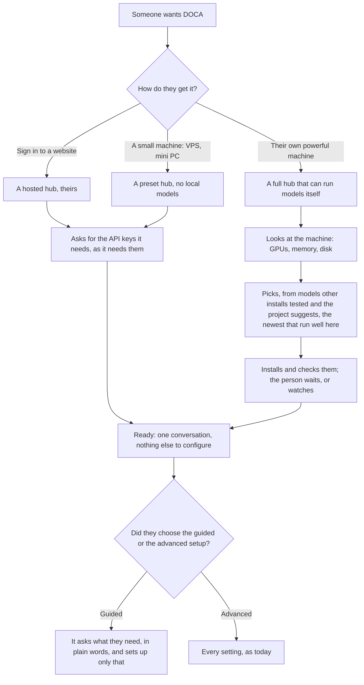
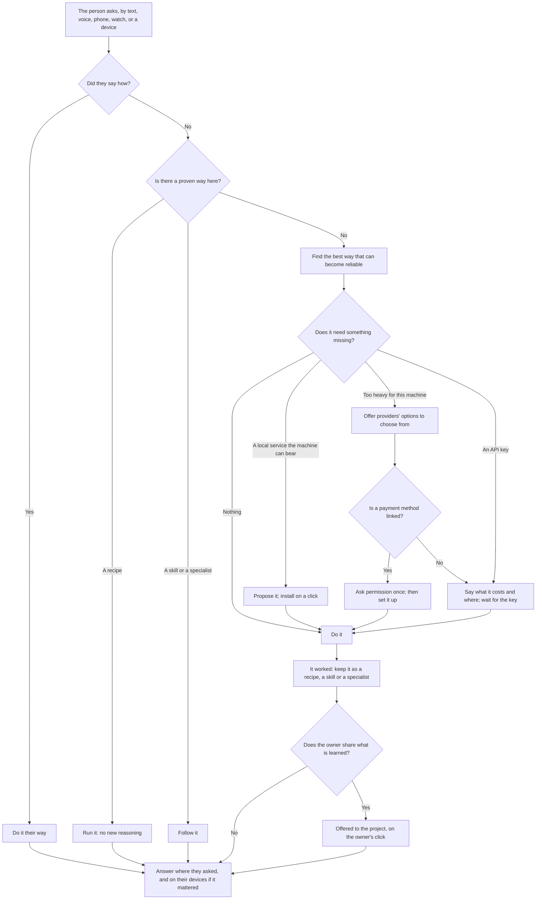
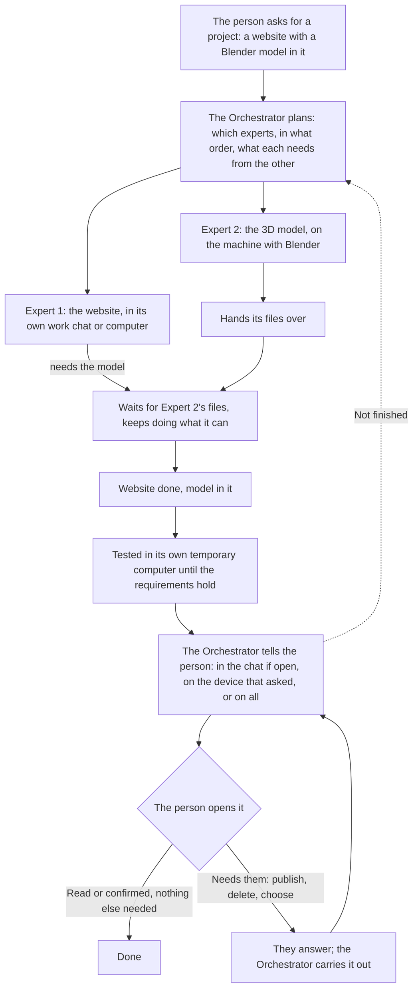
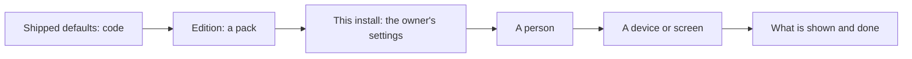

# The experience — what a person meets, and what each step must produce

Written 2026-10-07 from the owner's description of the product (CONSTITUTION §0). It defines **results**, not
screens: what a person must have at each step, where a real choice exists, and where the system decides for them.
Design and branding come later and build on this; nothing here picks a look.

Two people use the same product:

- **Someone who knows nothing** — it should feel like magic. They say what they want; it happens, or they are asked
  the one thing only they can answer.
- **Someone who wants to see and steer everything** — every setting, every agent, every device, every log (the panel
  as it is being built now).

They are not two products and not two code paths: the second sees the machinery the first never has to. Anything the
advanced view can do, the simple view can ask for in words.

## 1. Getting DOCA

**Results that must hold.** A first conversation works within minutes on any of the three. The person is never asked
something the machine can find out. A hub that can run nothing locally still does everything, through providers.
Exists today: the installers, the panel's first-run owner, models and services catalogues, provider keys. Missing:
the hosted sign-in offering; "pick the right models for this machine from what others tested" (the model scout looks,
but nothing collects other installs' results); a guided first setup.

## 2. Asking for anything

**Results that must hold.** The person never has to know what DOCA is made of. A real choice (money, something
outward or irreversible, taste) is asked once, with options; everything else is decided. Safety limits hold for the
system and for the person (the charter's Safety section; what cannot be undone is said in those words).
Exists today: the ladder in the charter and routing table (2.271.0), recipes, skills, specialists, install and
settings proposals, keys for services, `api_call`, the newcomer and routing evaluation sets. Missing: offering
providers' options when the machine cannot bear a model; spending with a linked payment method (none is linked —
needs its own safety design before anything is built).

## 3. A project, from request to done

**Results that must hold.** Work that is not finished keeps going until it is, or until the person says to archive,
forget or delete it — the Orchestrator never drops a project silently. The person can watch everything happening, or
nothing. Exists today: work chats, specialists, missions, computers for agents, plans, stopped-work and restart/drop,
devices told on start/finish, archive. Missing: experts waiting on each other's files (a dependency between missions);
"read = done" as an explicit state; the Orchestrator returning to unfinished projects on its own after a restart (it
asks today).

## 4. Every device is reachable

The person works on one project from several devices, fetches a file from one, installs something on another — by
asking. Exists: phone, watch, desktop and the node client as MCP hosts, the browser extension, files across devices,
pairing, device pages. Missing: install on another device by asking (the shell is there; a skill and a safe flow are
not).

## 5. Versatility: a personal change is data, not code

When someone asks the Orchestrator to change the panel itself — a layout, a page, a colour, a new button — that is
**their** change: it lives in their install's data, layered over the shipped defaults, and survives every update.
The code base changes only when the project changes.

Exists: this layering for settings (`settings-schema.js`, screens, editions). Missing: the panel's own structure as
data — pages, layouts, custom views — so the agent's "change the UI" edits that layer, not the repository. An update
may add safety; it never removes something a person had.

## 6. Secrets: usable, never readable

An agent uses a password, a token or a key without ever seeing it. Exists: provider keys and keys for services
(the hub adds them to requests), logins typed into a computer's browser by a hidden tool, masking everywhere.
Missing: the same on any device — a secret handed to a device's input for a set number of pastes and then forgotten,
never readable by the agent (a "sealed clipboard"), as the general form of what `computer_login` does for one
browser.

## Questions for the owner

Broad ones, because the specifics follow from them:

1. **Who is the first customer?** The person who knows nothing, or the person who wants to see everything? Both are
   kept; the first decides what "done" looks like for the next months.
2. **How much may DOCA spend on its own?** With a payment method linked, is there an amount below which it acts and
   tells, above which it asks — or is every spend asked?
3. **How far may it reach into a device unasked?** Installing on another device, reading its files, driving its
   screen: asked once per kind of action and remembered, or asked each time?
4. **What does "finished" mean for an open-ended project?** A website is never finished; when does the Orchestrator
   stop working on its own and wait to be asked?
5. **Whose is a personal change when the person leaves?** A change one person made to the panel: theirs only, the
   install's, or offered to everyone on it?
